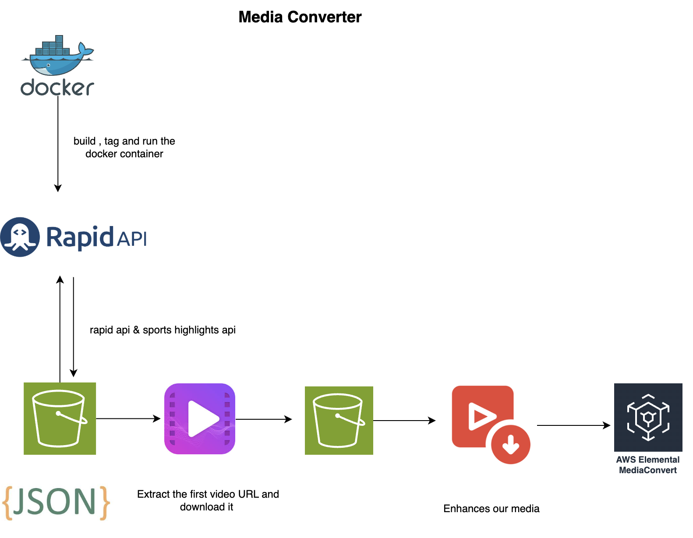

# day5-MediaConverter-

## Introduction

This is an application that download a video from the API. It then stores the video in S3. The Video is then taken by media converter and converted to a different format. The converted video is then stored in S3. The application then sends a notification to the user that the video has been converted.

## System Design



## Installation

##### set up Python with uv:

```bash
uv venv <env-name> --python 3.11
source <env-name>/bin/activate
uv pip install -r requirements.txt
```

##### Deploy the CloudFormation Stack

```bash
aws cloudformation create-stack --stack-name jsonb5 --template-body file://json_bucket.yaml --capabilities CAPABILITY_NAMED_IAM
```

##### Attach the iam policy

```bash
aws iam create-policy \
 --policy-name MyUpdatedMediaConvertPolicy \
 --policy-document file://managed-policy.json \
 --profile your-profile

aws iam attach-user-policy \\n  --user-name <user-name> \\n  --policy-arn arn:aws:iam::<account number></account>:policy/MyUpdatedMediaConvertPolicy
```
